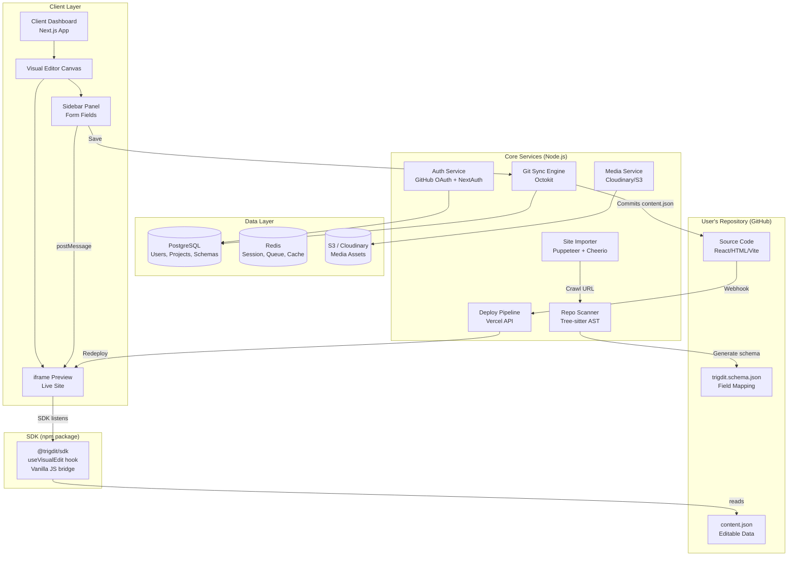
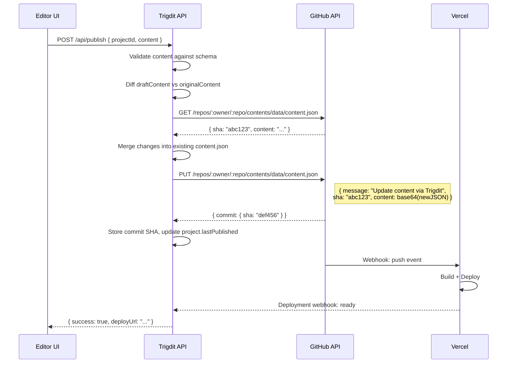

# Trigdit — Visual Website Builder Platform

A platform that gives non-technical business owners full visual editing power over modern, developer-built websites — replacing the need for Shopify/Wix/WordPress theme editors while preserving total developer freedom.

---

## The Problem

Business owners are locked into slow, rigid platforms (Shopify Liquid, WordPress PHP, Wix) for visual editing. Developers want modern stacks (React, Next.js, Vite) but clients need a Shopify-style "click and edit" experience. **No tool today bridges both worlds cleanly.**

## The Solution

Trigdit **completely separates Content from Code**:
- **Developers** build sites in any tech stack they want, push to GitHub, deploy to Vercel
- **Clients** get a premium visual dashboard to edit text, images, and sections — zero code knowledge required
- A lightweight **SDK bridge** + **repo scanner** connects the two via a `content.json` data layer

---

## High-Level System Architecture



---

## Tech Stack

| Layer | Technology | Rationale |
|---|---|---|
| **Monorepo** | Turborepo + pnpm | Shared types, fast builds, single CI |
| **Dashboard App** | Next.js 15 (App Router) + TypeScript | SSR for auth pages, RSC for dashboard, same ecosystem as user sites |
| **Styling** | Tailwind CSS + Radix UI primitives | Rapid premium UI development, accessible components |
| **Visual Canvas** | Custom iframe + postMessage protocol | Lightweight, framework-agnostic, no lock-in to Puck/Craft.js |
| **Backend API** | Next.js API Routes + tRPC | End-to-end type safety, co-located with dashboard |
| **Database** | PostgreSQL (via Drizzle ORM) | Relational data (users, projects, schemas), type-safe queries |
| **Cache/Queue** | Redis (Upstash serverless) | Session store, job queue for import/scan tasks |
| **Auth** | NextAuth.js v5 + GitHub OAuth | Users authenticate with GitHub, we get repo access tokens |
| **Git Client** | `@octokit/rest` | Commit content changes, read repo structure, manage branches |
| **Deploy** | Vercel API | Trigger deployments, get preview URLs, manage domains |
| **Media Storage** | Cloudinary (primary) / AWS S3 (fallback) | Image transforms, CDN delivery, upload widget |
| **Repo Scanner** | Tree-sitter (WASM) + custom AST walkers | Parse JSX/TSX/HTML without executing code, extract editable fields |
| **Site Importer** | Puppeteer (headless Chrome) + Cheerio | Full JS-rendered page capture for Shopify/Wix/WP sites |
| **SDK** | Vanilla JS + React hook (`@trigdit/sdk`) | Framework-agnostic bridge, ~2KB gzipped |
| **Background Jobs** | BullMQ (on Redis) | Long-running import/scan jobs, retry logic |
| **Hosting** | Vercel (dashboard) + Vercel (user sites) | Dogfooding our own deploy pipeline |

---

## Proposed Changes

### Monorepo Structure

```
trigdit/
├── apps/
│   ├── dashboard/              # Next.js 15 — the main Trigdit platform UI
│   │   ├── app/
│   │   │   ├── (auth)/         # Login, signup, GitHub OAuth callback
│   │   │   ├── (dashboard)/    # Protected routes
│   │   │   │   ├── projects/   # Project list, create new
│   │   │   │   ├── editor/     # The visual editor canvas
│   │   │   │   └── settings/   # Account, billing, domains
│   │   │   └── api/            # tRPC routes + webhooks
│   │   ├── components/
│   │   │   ├── editor/         # EditorCanvas, Sidebar, FieldRenderers
│   │   │   ├── ui/             # Design system (buttons, inputs, modals)
│   │   │   └── layout/         # Shell, navigation, responsive wrappers
│   │   └── lib/
│   │       ├── trpc/           # tRPC client + server setup
│   │       ├── auth/           # NextAuth config
│   │       └── stores/         # Zustand stores for editor state
│   │
│   └── docs/                   # Documentation site (Astro or Next.js)
│
├── packages/
│   ├── sdk/                    # @trigdit/sdk — the client-side bridge
│   │   ├── src/
│   │   │   ├── vanilla.ts      # Vanilla JS postMessage listener
│   │   │   ├── react.ts        # useVisualEdit() React hook
│   │   │   ├── vue.ts          # useVisualEdit() Vue composable (future)
│   │   │   └── types.ts        # Shared message protocol types
│   │   └── package.json
│   │
│   ├── scanner/                # @trigdit/scanner — repo analysis CLI + library
│   │   ├── src/
│   │   │   ├── index.ts        # Main entry: scan(projectRoot) → schema
│   │   │   ├── parsers/
│   │   │   │   ├── jsx.ts      # Tree-sitter JSX/TSX walker
│   │   │   │   ├── html.ts     # HTML parser for vanilla projects
│   │   │   │   └── vue-sfc.ts  # Vue SFC parser (future)
│   │   │   ├── extractors/
│   │   │   │   ├── text.ts     # Extract text content from AST nodes
│   │   │   │   ├── images.ts   # Extract img src, background-image
│   │   │   │   └── links.ts    # Extract href values
│   │   │   └── generators/
│   │   │       ├── schema.ts   # Generate trigdit.schema.json
│   │   │       └── content.ts  # Generate initial content.json
│   │   └── package.json
│   │
│   ├── importer/               # @trigdit/importer — site scraper + converter
│   │   ├── src/
│   │   │   ├── crawler.ts      # Puppeteer page crawler
│   │   │   ├── asset-downloader.ts  # Download CSS, images, fonts
│   │   │   ├── html-splitter.ts     # Split HTML into section blocks
│   │   │   ├── codegen.ts      # Generate Next.js project from sections
│   │   │   └── platforms/
│   │   │       ├── shopify.ts  # Shopify-specific extraction (checkout URLs, etc.)
│   │   │       ├── wordpress.ts # WordPress REST API connector
│   │   │       └── wix.ts      # Wix headless SDK connector
│   │   └── package.json
│   │
│   ├── db/                     # @trigdit/db — Drizzle schema + migrations
│   │   ├── src/
│   │   │   ├── schema.ts       # All table definitions
│   │   │   ├── client.ts       # Database client factory
│   │   │   └── migrations/     # SQL migration files
│   │   └── package.json
│   │
│   └── shared/                 # @trigdit/shared — shared types + utils
│       ├── src/
│       │   ├── types.ts        # ContentSchema, FieldType, Project, etc.
│       │   ├── protocol.ts     # postMessage event types
│       │   └── constants.ts    # Shared constants
│       └── package.json
│
├── turbo.json
├── pnpm-workspace.yaml
└── package.json
```

---

### Subsystem 1: Site Importer (`@trigdit/importer`)

The importer handles the "bring your existing Shopify/WordPress/Wix site" flow.

#### [NEW] [crawler.ts](file:///Users/ajay/Desktop/Projects/trigdit/packages/importer/src/crawler.ts)
- Uses **Puppeteer** (headless Chrome) to navigate to the target URL
- Waits for full JS rendering (critical for Shopify Liquid, WordPress dynamic content)
- Captures the **final rendered DOM** (not raw source) — this bypasses all template languages
- Extracts:
  - Full HTML document
  - All linked stylesheets (resolved URLs)
  - All images, fonts, and script assets
  - Viewport screenshots for visual reference

#### [NEW] [html-splitter.ts](file:///Users/ajay/Desktop/Projects/trigdit/packages/importer/src/html-splitter.ts)
- Parses the captured HTML into an AST using `htmlparser2`
- Identifies top-level structural blocks: `<header>`, `<nav>`, `<section>`, `<main>`, `<footer>`, `<aside>`
- Falls back to `<div>` elements with layout-class heuristics (e.g., `container`, `wrapper`, `row`, `col-*`, `flex`, `grid`)
- Assigns each block a stable UUID
- Extracts editable text nodes and image sources, replacing them with placeholder tokens (`__SECTION_abc_TITLE__`)

#### [NEW] [codegen.ts](file:///Users/ajay/Desktop/Projects/trigdit/packages/importer/src/codegen.ts)
- Generates a complete Next.js 15 project from the split sections:
  - `app/page.tsx` — renders sections in order using a `DynamicSection` component
  - `app/components/DynamicSection.tsx` — renders raw HTML with `dangerouslySetInnerHTML`, replaces tokens from `content.json`
  - `public/assets/` — all downloaded images, fonts, stylesheets
  - `data/content.json` — the editable content data file
  - `trigdit.schema.json` — the field schema for the visual editor
  - Installs `@trigdit/sdk` and wires the postMessage bridge
- Commits the generated project to a new GitHub repo via Octokit
- Triggers initial Vercel deployment

#### [NEW] [platforms/shopify.ts](file:///Users/ajay/Desktop/Projects/trigdit/packages/importer/src/platforms/shopify.ts)
- Detects Shopify stores by checking for `Shopify.` globals, `myshopify.com` URLs, or `cdn.shopify.com` assets
- Preserves checkout links (`/cart`, `/checkout`) as-is — they redirect to the native Shopify checkout
- Extracts product grid sections and maps them to the Shopify Storefront GraphQL API for dynamic product data

---

### Subsystem 2: Repo Scanner (`@trigdit/scanner`)

For developers who bring their **own codebase** (React, Vite, vanilla HTML), the scanner analyzes the project and generates the schema + content files.

#### [NEW] [parsers/jsx.ts](file:///Users/ajay/Desktop/Projects/trigdit/packages/scanner/src/parsers/jsx.ts)
- Uses **Tree-sitter** (compiled to WASM for portability) with the JSX/TSX grammar
- Walks the AST looking for:
  - JSX text nodes (string literals inside elements): `<h1>Welcome</h1>` → editable text field
  - JSX attribute values: `src="/hero.jpg"` → editable image field
  - Template literals with content: `` `Hello ${name}` `` → flagged but excluded (dynamic)
  - Ternary expressions: skipped (too fragile to edit)
- Records each editable field with its:
  - Component name and file path
  - AST node location (line, column)
  - Field type (`text`, `image`, `link`, `richtext`)
  - Current value

#### [NEW] [parsers/html.ts](file:///Users/ajay/Desktop/Projects/trigdit/packages/scanner/src/parsers/html.ts)
- For vanilla HTML projects
- Uses `htmlparser2` to walk the DOM
- Extracts text from heading tags (`h1`-`h6`), paragraphs, spans, buttons, links
- Extracts `src` from `img`, `video`, `source` tags
- Extracts `href` from `a` tags
- Matches elements by `id` attribute (preferred) or generates stable selectors

#### [NEW] [generators/schema.ts](file:///Users/ajay/Desktop/Projects/trigdit/packages/scanner/src/generators/schema.ts)
- Produces `trigdit.schema.json` — the contract between the scanner and the visual editor:

```json
{
  "version": "1.0",
  "project": "client-storefront",
  "framework": "react-vite",
  "pages": [
    {
      "path": "/",
      "file": "src/pages/Home.tsx",
      "sections": [
        {
          "id": "hero_section",
          "component": "HeroBanner",
          "file": "src/components/HeroBanner.tsx",
          "fields": [
            {
              "key": "hero_title",
              "type": "text",
              "label": "Hero Title",
              "selector": "h1",
              "line": 14,
              "column": 6
            },
            {
              "key": "hero_image",
              "type": "image",
              "label": "Hero Background",
              "selector": "img.hero-bg",
              "line": 18,
              "column": 10
            }
          ]
        }
      ]
    }
  ]
}
```

#### [NEW] [generators/content.ts](file:///Users/ajay/Desktop/Projects/trigdit/packages/scanner/src/generators/content.ts)
- Produces `content.json` — the actual data file that the SDK reads at runtime:

```json
{
  "hero_title": "Welcome to our Shop",
  "hero_image": "/images/hero.jpg",
  "nav_cta_text": "Shop Now",
  "footer_copyright": "© 2026 My Store"
}
```

---

### Subsystem 3: SDK Bridge (`@trigdit/sdk`)

The tiny, framework-agnostic script that lives inside the user's project and enables real-time editing.

#### [NEW] [vanilla.ts](file:///Users/ajay/Desktop/Projects/trigdit/packages/sdk/src/vanilla.ts)
```typescript
// ~1.5KB gzipped — auto-activates only when loaded inside the Trigdit editor iframe
export function initTrigditBridge(contentJsonPath: string) {
  if (window.self === window.top) return; // Not in iframe, do nothing

  window.addEventListener('message', (event) => {
    // Verify origin matches Trigdit dashboard
    if (!event.origin.includes('trigdit')) return;

    const { type, key, value } = event.data;

    if (type === 'TRIGDIT_UPDATE_FIELD') {
      // Update DOM element by data-trigdit-key attribute or id
      const el = document.querySelector(`[data-trigdit-key="${key}"]`) 
                || document.getElementById(key);
      if (el) {
        if (el instanceof HTMLImageElement) el.src = value;
        else el.textContent = value;
      }
    }

    if (type === 'TRIGDIT_HIGHLIGHT') {
      // Highlight the element being edited with a visual outline
      const el = document.querySelector(`[data-trigdit-key="${key}"]`);
      if (el) el.classList.toggle('trigdit-highlight', true);
    }
  });

  // Notify parent that the bridge is ready
  window.parent.postMessage({ type: 'TRIGDIT_BRIDGE_READY' }, '*');
}
```

#### [NEW] [react.ts](file:///Users/ajay/Desktop/Projects/trigdit/packages/sdk/src/react.ts)
```typescript
import { useState, useEffect } from 'react';

export function useVisualEdit<T extends Record<string, any>>(initialContent: T): T {
  const [content, setContent] = useState<T>(initialContent);

  useEffect(() => {
    if (window.self === window.top) return; // Not in iframe

    const handler = (event: MessageEvent) => {
      if (!event.origin.includes('trigdit')) return;
      const { type, key, value } = event.data;

      if (type === 'TRIGDIT_UPDATE_FIELD' && key in content) {
        setContent(prev => ({ ...prev, [key]: value }));
      }
    };

    window.addEventListener('message', handler);
    window.parent.postMessage({ type: 'TRIGDIT_BRIDGE_READY' }, '*');

    return () => window.removeEventListener('message', handler);
  }, []);

  return content;
}
```

---

### Subsystem 4: Visual Editor Dashboard (`apps/dashboard`)

The premium Next.js web application where clients log in, see their live site, and edit content.

#### Key Pages

| Route | Purpose |
|---|---|
| `/` | Landing page / marketing site |
| `/login` | GitHub OAuth sign-in |
| `/projects` | List all connected projects |
| `/projects/new` | Import from URL or connect existing repo |
| `/editor/[projectId]` | **The main visual editor** — sidebar + iframe canvas |
| `/settings` | Account, team, billing |

#### Editor Canvas Architecture

```
┌─────────────────────────────────────────────────────────────┐
│ TopBar: [← Back] [Project Name ▾] [Preview ▾] [⟳] [Publish]│
├──────────────────────┬──────────────────────────────────────┤
│                      │                                      │
│   Sidebar Panel      │      iframe Preview Canvas           │
│                      │                                      │
│  ┌────────────────┐  │   ┌──────────────────────────────┐  │
│  │ Page: Home   ▾ │  │   │                              │  │
│  ├────────────────┤  │   │   Live Vercel preview URL    │  │
│  │                │  │   │                              │  │
│  │ 📝 Hero Title  │  │   │   User's actual website      │  │
│  │ [Summer Sale!] │  │◀──│   rendered at full fidelity  │  │
│  │                │  │   │                              │  │
│  │ 🖼 Hero Image  │  │   │   @trigdit/sdk listens for   │  │
│  │ [Upload ▲]     │  │   │   postMessage events         │  │
│  │                │  │   │                              │  │
│  │ 📝 CTA Button  │  │   │                              │  │
│  │ [Shop Now]     │  │   │                              │  │
│  │                │  │   └──────────────────────────────┘  │
│  └────────────────┘  │                                      │
│                      │   Device: [📱 Mobile] [💻 Desktop]   │
├──────────────────────┴──────────────────────────────────────┤
│ StatusBar: Last published 2 min ago • 3 unsaved changes     │
└─────────────────────────────────────────────────────────────┘
```

The sidebar dynamically renders form fields based on `trigdit.schema.json`:
- `text` → `<input type="text">` or `<textarea>`
- `richtext` → A rich text editor (TipTap)
- `image` → Upload widget (Cloudinary) with preview thumbnail
- `link` → URL input with validation
- `color` → Color picker

Each keystroke fires a `postMessage` to the iframe for instant visual feedback. No round-trips to the server until "Publish".

#### Editor State Management (Zustand)

```typescript
interface EditorStore {
  // Current project
  project: Project;
  schema: TrigditSchema;
  
  // Content state
  originalContent: Record<string, any>;  // Last published state
  draftContent: Record<string, any>;     // Current edits
  
  // UI state
  activePage: string;
  activeSection: string | null;
  previewDevice: 'desktop' | 'tablet' | 'mobile';
  iframeReady: boolean;
  
  // Actions
  updateField: (key: string, value: any) => void;   // Updates draft + fires postMessage
  publish: () => Promise<void>;                       // Commits to GitHub
  revert: () => void;                                 // Resets draft to original
  getDirtyFields: () => string[];                     // List of changed keys
}
```

---

### Subsystem 5: Git Sync Engine

The service that commits content changes to the user's GitHub repository.

#### Publish Flow



> [!IMPORTANT]
> We use the **GitHub Contents API** (not `git` CLI) so there's zero server-side Git setup. The user's GitHub OAuth token (scoped to the specific repo) is the only credential needed.

---

### Subsystem 6: Database Schema

#### [NEW] [schema.ts](file:///Users/ajay/Desktop/Projects/trigdit/packages/db/src/schema.ts)

```typescript
// Core tables (Drizzle ORM)

users {
  id            UUID PK
  githubId      VARCHAR UNIQUE
  email         VARCHAR
  name          VARCHAR
  avatarUrl     VARCHAR
  accessToken   VARCHAR (encrypted)  // GitHub OAuth token
  createdAt     TIMESTAMP
}

projects {
  id            UUID PK
  userId        UUID FK → users.id
  name          VARCHAR
  repoOwner     VARCHAR              // GitHub org/user
  repoName      VARCHAR              // Repository name
  repoBranch    VARCHAR DEFAULT 'main'
  framework     ENUM('nextjs','react-vite','vanilla-html','astro','vue','svelte','imported')
  sourceUrl     VARCHAR NULLABLE      // Original Shopify/WP/Wix URL if imported
  previewUrl    VARCHAR               // Vercel preview URL
  productionUrl VARCHAR NULLABLE      // Custom domain
  schemaPath    VARCHAR DEFAULT 'trigdit.schema.json'
  contentPath   VARCHAR DEFAULT 'data/content.json'
  lastPublished TIMESTAMP NULLABLE
  lastScanned   TIMESTAMP NULLABLE
  status        ENUM('importing','scanning','ready','error')
  createdAt     TIMESTAMP
}

publish_history {
  id            UUID PK
  projectId     UUID FK → projects.id
  userId        UUID FK → users.id
  commitSha     VARCHAR
  contentSnapshot JSONB              // Full content.json at time of publish
  changedFields TEXT[]               // List of keys that were modified
  createdAt     TIMESTAMP
}

media_uploads {
  id            UUID PK
  projectId     UUID FK → projects.id
  userId        UUID FK → users.id
  originalName  VARCHAR
  cloudinaryUrl VARCHAR
  mimeType      VARCHAR
  sizeBytes     INTEGER
  createdAt     TIMESTAMP
}
```

---

## Phased Execution Roadmap

### Phase 1: Foundation (Weeks 1–3)
> Goal: Boot the monorepo, auth flow, and a basic editor that can display a connected repo's site in an iframe.

- [ ] Initialize Turborepo monorepo with pnpm
- [ ] Set up `apps/dashboard` with Next.js 15 + TypeScript + Tailwind
- [ ] Implement GitHub OAuth via NextAuth.js v5
- [ ] Set up PostgreSQL (local Docker + Neon for prod) with Drizzle ORM
- [ ] Build project CRUD: create project → connect to a GitHub repo
- [ ] Integrate Vercel API: deploy a connected repo, get preview URL
- [ ] Build basic editor page: load preview URL in an iframe with a skeleton sidebar
- [ ] Build the `@trigdit/shared` types package

### Phase 2: The SDK + Scanner (Weeks 4–6)
> Goal: A developer can install `@trigdit/sdk`, run the scanner CLI, and have their site become editable in the Trigdit editor.

- [ ] Build `@trigdit/sdk` with the `useVisualEdit()` React hook and vanilla JS bridge
- [ ] Build `@trigdit/scanner` with Tree-sitter JSX/TSX parser
- [ ] Build `@trigdit/scanner` HTML parser for vanilla projects
- [ ] Build schema generator → `trigdit.schema.json`
- [ ] Build content generator → `content.json`
- [ ] Build the scanner CLI: `npx @trigdit/scanner init`
- [ ] Wire the editor sidebar to dynamically render fields from the schema
- [ ] Implement postMessage protocol: sidebar keystroke → iframe update
- [ ] Implement the Publish flow: sidebar → tRPC API → GitHub Contents API → Vercel redeploy

### Phase 3: Site Importer (Weeks 7–9)
> Goal: A user pastes a Shopify/WordPress URL and gets a fully editable Next.js project generated and deployed.

- [ ] Build Puppeteer crawler with full JS rendering
- [ ] Build asset downloader (CSS, images, fonts, scripts)
- [ ] Build HTML section splitter with structural heuristics
- [ ] Build Next.js code generator (project scaffolding + `DynamicSection` component)
- [ ] Build Shopify platform detector + checkout link preservation
- [ ] Build WordPress platform detector + REST API connector
- [ ] Wire the "Import from URL" flow in the dashboard UI
- [ ] Background job processing with BullMQ (import can take 30–60 seconds)
- [ ] Progress UI with real-time status updates (via server-sent events or polling)

### Phase 4: Polish & Production (Weeks 10–12)
> Goal: Production-ready platform with premium UX, media uploads, version history, and domain management.

- [ ] Cloudinary media upload integration in the editor sidebar
- [ ] Publish history with rollback (revert to any previous `content.json` snapshot)
- [ ] Custom domain management via Vercel API
- [ ] Multi-page support: scan all pages, switch between them in the editor
- [ ] Responsive preview toggle: desktop → tablet → mobile viewport
- [ ] Keyboard shortcuts (Cmd+S → save draft, Cmd+Shift+P → publish)
- [ ] Error handling: build failures, disconnected repos, invalid schemas
- [ ] Landing page + documentation site
- [ ] Rate limiting, security hardening, CSRF protection
- [ ] E2E tests with Playwright

---

## Open Questions

> [!IMPORTANT]
> **Approach A vs B hybrid?** Should the scanner also support Approach A ("Pure Code Modifier" — editing actual source code lines) as an advanced mode for developers who don't want a `content.json` indirection layer? This would be powerful but riskier. We could make it opt-in with a `"mode": "direct"` flag in `trigdit.schema.json`.

> [!IMPORTANT]
> **Pricing model**: Should Trigdit be fully open-source (like TinaCMS) with optional managed hosting, or a SaaS product with a free tier? This affects whether we build a self-hosted installer or focus purely on the hosted platform.

> [!WARNING]
> **Wix import complexity**: Unlike Shopify and WordPress, Wix sites are extremely JavaScript-heavy and don't expose clean HTML structures. The Puppeteer crawler will capture the rendered DOM, but Wix's obfuscated class names (`_2F4kN`, `_1tLqB`) make section splitting unreliable. We should deprioritize Wix imports and focus on Shopify + WordPress first.

---

## Verification Plan

### Automated Tests
- `pnpm test` — runs Vitest unit tests across all packages
- `pnpm test:e2e` — runs Playwright E2E tests for the full editor flow
- `pnpm test:scanner` — runs the scanner against fixture projects (React, Vite, HTML) and validates schema output
- `pnpm lint` — ESLint + TypeScript strict mode across the monorepo

### Manual Verification
1. **Scanner flow**: Clone a sample React project → run `npx @trigdit/scanner init` → verify `trigdit.schema.json` and `content.json` are generated correctly
2. **Editor flow**: Connect the scanned project → verify fields appear in the sidebar → edit a field → verify iframe updates in real-time → click Publish → verify GitHub commit + Vercel redeploy
3. **Import flow**: Paste a live Shopify store URL → verify the generated Next.js project renders identically to the original → verify editing works
4. **SDK flow**: Install `@trigdit/sdk` in a fresh Vite project → add `useVisualEdit()` → verify it works outside Trigdit (returns static data) and inside the editor iframe (receives live updates)
