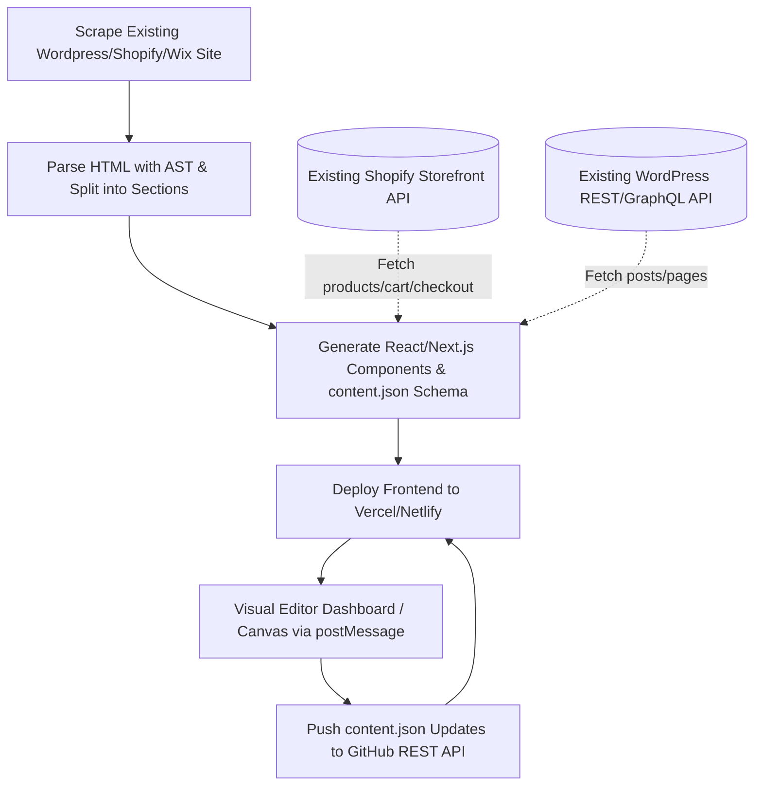

# Visual Website Builder & Headless CMS Research

This document outlines the research on existing open-source tools, repositories, and strategies to build a visual builder platform that decouples **Content from Code** and integrates seamlessly with Git, Next.js, and legacy platforms (Shopify, Wix, WordPress).

---

## 🏗️ Core Architectural Idea

The platform separates the **Layout/Code (developers)** from the **Content/Data (clients)**:
1. **Developer Freedom**: Write React/Vite/Next.js code natively, referencing content from a `content.json` file.
2. **Client Control**: A beautiful dashboard allows non-technical users to edit text/images visually.
3. **The Iframe Bridge**: The dashboard renders the live site in an iframe, synchronizing edits in real-time via browser `postMessage`.
4. **Git Sync**: Clicking "Publish" triggers a commit containing the updated JSON content directly to GitHub via its REST API, which automatically triggers a Vercel deployment.

---

## 🛠️ Existing Open-Source Tools & Repositories

Rather than building everything from scratch, we can leverage or draw inspiration from several popular open-source libraries:

### 1. Visual Page Editors & Component Builders (UI Canvas)
These libraries provide drag-and-drop or visual interfaces that can run inside our editor dashboard or react to page frames:
*   **[Puck (puckeditor/puck)](https://github.com/puckeditor/puck)**: The most popular modular visual editor for React. It allows registering custom components and generates JSON data mapping. Highly customizable and developer-focused.
*   **[Chai Builder (chaibuilder/chaibuilder)](https://github.com/chaibuilder/chaibuilder)**: A React-first open-source web builder template using Next.js and Tailwind CSS.
*   **[React Rewrite (donghaxkim/react-rewrite)](https://github.com/donghaxkim/react-rewrite)**: An editor that directly parses and modifies React source code files (similar to Approach A: "Pure Code Modifier").
*   **[Craft.js (prevwong/craft.js)](https://github.com/prevwong/craft.js)**: A React framework for building custom drag-and-drop page editors.

### 2. Git-Backed Headless CMS Engines (Git & Iframe Sync)
These tools demonstrate how to map visual editing to Git commits and JSON schemas:
*   **[TinaCMS (tinacms/tinacms)](https://github.com/tinacms/tinacms)**: The premier open-source Git-backed CMS. It uses a custom hook (`useTina`) to listen for iframe `postMessage` changes and updates the page state in real-time, then saves content back to Git as Markdown or JSON.
*   **[Decap CMS (decapcms/decapcms)](https://github.com/decapcms/decapcms)**: An established Git-based CMS that interacts directly with the GitHub API to update repository data files.
*   **[Outstatic (outstatic/outstatic)](https://github.com/outstatic/outstatic)**: A clean, Next.js-native Git CMS that runs entirely inside the project repository.

### 3. HTML Crawlers, Parsers, & JSX Converters
To import existing Shopify, Wix, or WordPress websites and translate them to React:
*   **[html-to-react-components (roman01la/html-to-react-components)](https://github.com/roman01la/html-to-react-components)**: Converts static HTML templates into separate React components.
*   **[html-react-parser (remarkablemark/html-react-parser)](https://github.com/remarkablemark/html-react-parser)**: Parses raw HTML strings directly into React elements and supports custom element replacers.
*   **[Cheerio / Puppeteer](https://github.com/cheeriojs/cheerio)**: NodeJS utilities to scrape websites, download static styles, scripts, fonts, and assets, and build a local representation of the site.

---

## ⚡ How Legacy Platforms (WordPress, Shopify, Wix) Can Still Work Here

To migrates users from slow, buggy, or rigid theme engines to a high-performance modern stack, we can apply a **Decoupled Headless Strategy**:

### 1. Shopify Integration
*   **The Storefront**: We generate a headless Shopify storefront using Next.js (utilizing templates like `vercel/commerce` or `BuilderIO/nextjs-shopify`).
*   **The Backend**: Shopify remains the source of truth for products, collections, inventory, cart management, and checkout.
*   **Zero-Config Checkout Integration**: Because we crawled the original Shopify pages, the checkout links (like `https://yourstore.myshopify.com/cart/...`) and Shopify checkout scripts remain fully functional. When a user clicks "Buy Now" on the Next.js site, they are redirected seamlessly to the merchant's secure native Shopify checkout page.

### 2. WordPress Integration
*   **The Storefront**: We build a Next.js blog template that fetches posts dynamically using the WordPress REST API or WPGraphQL (drawing inspiration from `wpengine/faustjs` or `9d8dev/next-wp`).
*   **Dynamic Gutenberg Sections**: For block-style editing, we map Gutenberg blocks directly to matching React components on the frontend. The content editor allows updating the page structure while keeping the database synced.

### 3. Wix Integration
*   **Headless Wix**: We utilize the Wix Headless SDK to manage bookings, product catalogs, and checkouts from the React frontend, while the visual editor governs the aesthetic look and static landing page text/images.

---

## 🚀 Key Libraries Proposed for the Build

*   **Frontend Engine**: Next.js (with App Router) or React + Vite.
*   **Visual Frame Sync**: Simple SDK wrapper for client pages that listens to `'message'` events from `window.parent`.
*   **HTML to React Parser**: `html-react-parser` or `rehype` for AST analysis.
*   **Git Client**: `@octokit/rest` for seamless GitHub commits.
*   **Visual canvas base**: `puck` or `craft.js` as reference models for mapping JSON states to visual blocks.
